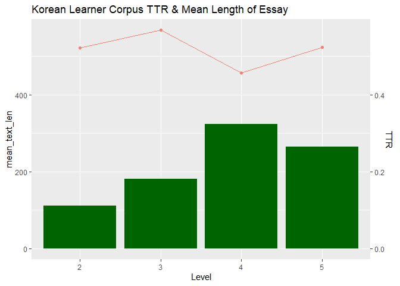

Final Project
================
Soobin Choi
2022-10-01

- <a href="#developmental-process-of-l2---english-and-korean"
  id="toc-developmental-process-of-l2---english-and-korean">Developmental
  process of L2 - English and Korean</a>
  - <a href="#korean-learners-corpus-klc"
    id="toc-korean-learners-corpus-klc">Korean Learners’ Corpus (KLC)</a>
    - <a href="#data-import" id="toc-data-import">Data Import</a>
    - <a href="#klc-final" id="toc-klc-final">KLC final</a>
  - <a href="#pelic" id="toc-pelic">PELIC</a>
    - <a href="#data-import-1" id="toc-data-import-1">Data Import</a>
    - <a href="#data-manipulation" id="toc-data-manipulation">Data
      manipulation</a>
  - <a href="#pelic-final" id="toc-pelic-final">PELIC final</a>
  - <a href="#comparison-between-klc-and-pelic"
    id="toc-comparison-between-klc-and-pelic">Comparison between KLC and
    PELIC</a>
    - <a href="#data-visualization" id="toc-data-visualization">Data
      Visualization</a>

# Developmental process of L2 - English and Korean

``` r
knitr::opts_chunk$set(echo=TRUE, include=TRUE, comment="")
library(tidyverse)
library(tidytext)
library(repurrrsive)
library(quanteda)
```

    ## Warning: 패키지 'quanteda'는 R 버전 4.2.2에서 작성되었습니다

    ## Warning in .recacheSubclasses(def@className, def, env): 클래스 "mMatrix"의 서브
    ## 클래스 "unpackedMatrix"가 정의되지 않았습니다; 업데이트된 정의가 아닙니다

    ## Warning in .recacheSubclasses(def@className, def, env): 클래스 "replValueSp"의
    ## 서브 클래스 "unpackedMatrix"가 정의되지 않았습니다; 업데이트된 정의가 아닙니다

``` r
library(magrittr)
library(ggplot2)
```

## Korean Learners’ Corpus (KLC)

### Data Import

``` r
KLC <- read_tsv(file = "https://github.com/jungyeul/korean-learner-corpus/raw/main/data/kyunghee_v2.tsv", locale(encoding = "UTF-8")) 
```

    Warning: One or more parsing issues, see `problems()` for details

    Rows: 4094 Columns: 8
    ── Column specification ────────────────────────────────────────────────────────
    Delimiter: "\t"
    chr (7): X1, X2, X3, X4, X5, X6, X7
    dbl (1): X8

    ℹ Use `spec()` to retrieve the full column specification for this data.
    ℹ Specify the column types or set `show_col_types = FALSE` to quiet this message.

``` r
KLC <- KLC %>% 
  rename(ID = X1,
         Nationality = X2,
         Gender = X3,
         Topic = X4,
         Text = X5,
         Morphemes = X6,
         Level = X7,
         Score = X8)

KLC_clean <- KLC %>% 
  filter(Level %in% c("A1", "A2", "B1", "B2", "C1", "C2"))

KLC_eng <- KLC_clean %>% 
  filter(Nationality %in% c("미국", "영국", "호주", "필리핀", "싱가포르", "인도", "르완다"))

KLC_clean <- KLC_eng %>%
  select(ID, Morphemes) %>% 
  map(~ str_split(., " (\\+)?")) %>% 
  as_data_frame() %>% 
  rename(num_token = Morphemes) %>% 
  unnest(ID) %>% 
  left_join(KLC_eng, .,  by="ID") %>% 
  relocate(num_token, .after = ID) %>% 
  select(-c(Gender, Topic))
```

    Warning: `as_data_frame()` was deprecated in tibble 2.0.0.
    Please use `as_tibble()` instead.
    The signature and semantics have changed, see `?as_tibble`.
    This warning is displayed once every 8 hours.
    Call `lifecycle::last_lifecycle_warnings()` to see where this warning was generated.

``` r
KLC_numtok <- KLC_clean %>% 
  unnest(num_token) %>% 
  mutate_all(funs(str_replace(., "A1", "2"))) %>% 
  mutate_all(funs(str_replace(., "A2", "2"))) %>% 
  mutate_all(funs(str_replace(., "B1", "3"))) %>% 
  mutate_all(funs(str_replace(., "B2", "4"))) %>% 
  mutate_all(funs(str_replace(., "C1", "5"))) %>% 
  mutate_all(funs(str_replace(., "C2", "5"))) %>% 
  group_by(ID) %>% 
  count(Level, name = "num_token")
```

    Warning: `funs()` was deprecated in dplyr 0.8.0.
    Please use a list of either functions or lambdas: 

      # Simple named list: 
      list(mean = mean, median = median)

      # Auto named with `tibble::lst()`: 
      tibble::lst(mean, median)

      # Using lambdas
      list(~ mean(., trim = .2), ~ median(., na.rm = TRUE))
    This warning is displayed once every 8 hours.
    Call `lifecycle::last_lifecycle_warnings()` to see where this warning was generated.

``` r
KLC_numdist <- KLC_clean %>% 
  unnest(num_token) %>% 
  mutate_all(funs(str_replace(., "A1", "2"))) %>% 
  mutate_all(funs(str_replace(., "A2", "2"))) %>% 
  mutate_all(funs(str_replace(., "B1", "3"))) %>% 
  mutate_all(funs(str_replace(., "B2", "4"))) %>% 
  mutate_all(funs(str_replace(., "C1", "5"))) %>% 
  mutate_all(funs(str_replace(., "C2", "5"))) %>% 
  group_by(ID) %>% 
  summarize(num_dist = n_distinct(num_token))


KLC_TTR <- left_join(KLC_numdist, KLC_numtok, by = "ID") %>% 
   mutate(TTR = round((num_dist / num_token),4)) %>% 
   rename(mean_text_len = num_token) %>% 
   select(-ID) %>% 
   group_by(Level) %>% 
   summarize(mean_text_len = mean(mean_text_len),
             TTR = round(mean(TTR), 4))

KLC_TTR
```

    # A tibble: 4 × 3
      Level mean_text_len   TTR
      <chr>         <dbl> <dbl>
    1 2              111. 0.522
    2 3              181. 0.568
    3 4              324. 0.457
    4 5              265. 0.523

#### 2. Syntactic Complexity

how to calculate syntactic complexity: compare average sentence length

``` r
KLC_sent <- KLC_clean %>% 
  unnest_tokens(Sentence, Text, "sentences") 

KLC_morph <- KLC_sent %>% 
  unnest(num_token) %>% 
  mutate(sent_num = lag(num_token) %>% 
           str_detect("/EF$") %>% 
           replace_na(FALSE) %>% 
           cumsum() %>% 
           add(1),
         .after = num_token)

KLC_syncom <- KLC_morph %>% 
  select(-Nationality, -Morphemes, -Score, -Sentence) %>% 
  group_by(sent_num) %>% 
  mutate(sent_len = length(ID)) %>% 
  mutate_all(funs(str_replace(., "A1", "A2"))) %>% 
  mutate_all(funs(str_replace(., "C2", "C1"))) %>% 
  mutate(sent_len = as.numeric(sent_len)) %>% 
  group_by(Level) %>% 
  summarize(mean_sent_len = mean(sent_len))
```

    `mutate_all()` ignored the following grouping variables:
    `mutate_all()` ignored the following grouping variables:
    • Column `sent_num`
    ℹ Use `mutate_at(df, vars(-group_cols()), myoperation)` to silence the message.

### KLC final

``` r
KLC_TTR
```

    # A tibble: 4 × 3
      Level mean_text_len   TTR
      <chr>         <dbl> <dbl>
    1 2              111. 0.522
    2 3              181. 0.568
    3 4              324. 0.457
    4 5              265. 0.523

``` r
KLC_syncom
```

    # A tibble: 4 × 2
      Level mean_sent_len
      <chr>         <dbl>
    1 A2             12.6
    2 B1             15.3
    3 B2             25.7
    4 C1             28.0

## PELIC

### Data Import

``` r
PELIC_ans <- read_csv("https://github.com/ELI-Data-Mining-Group/PELIC-dataset/raw/master/corpus_files/answer.csv")
```

    Rows: 46204 Columns: 10
    ── Column specification ────────────────────────────────────────────────────────
    Delimiter: ","
    chr  (4): anon_id, text, tokens, tok_lem_POS
    dbl  (5): answer_id, question_id, course_id, version, text_len
    dttm (1): created_date

    ℹ Use `spec()` to retrieve the full column specification for this data.
    ℹ Specify the column types or set `show_col_types = FALSE` to quiet this message.

``` r
PELIC_crs <- read_csv("https://github.com/ELI-Data-Mining-Group/PELIC-dataset/raw/master/corpus_files/course.csv")
```

    Rows: 1066 Columns: 5
    ── Column specification ────────────────────────────────────────────────────────
    Delimiter: ","
    chr (3): class_id, semester, section
    dbl (2): course_id, level_id

    ℹ Use `spec()` to retrieve the full column specification for this data.
    ℹ Specify the column types or set `show_col_types = FALSE` to quiet this message.

``` r
PELIC_id <- read_csv("https://github.com/ELI-Data-Mining-Group/PELIC-dataset/raw/master/corpus_files/student_information.csv")
```

    Rows: 1313 Columns: 21
    ── Column specification ────────────────────────────────────────────────────────
    Delimiter: ","
    chr (19): anon_id, gender, native_language, language_used_at_home, non_nativ...
    dbl  (2): birth_year, age

    ℹ Use `spec()` to retrieve the full column specification for this data.
    ℹ Specify the column types or set `show_col_types = FALSE` to quiet this message.

``` r
PELIC_scr <- read_csv("https://github.com/ELI-Data-Mining-Group/PELIC-dataset/raw/master/corpus_files/test_scores.csv")
```

    Rows: 1141 Columns: 10
    ── Column specification ────────────────────────────────────────────────────────
    Delimiter: ","
    chr (3): anon_id, semester, MTELP_Form
    dbl (7): LCT_Form, LCT_Score, MTELP_I, MTELP_II, MTELP_III, MTELP_Conv_Score...

    ℹ Use `spec()` to retrieve the full column specification for this data.
    ℹ Specify the column types or set `show_col_types = FALSE` to quiet this message.

``` r
PELIC_ques <- read_csv("https://github.com/ELI-Data-Mining-Group/PELIC-dataset/raw/master/corpus_files/question.csv")
```

    Rows: 6117 Columns: 4
    ── Column specification ────────────────────────────────────────────────────────
    Delimiter: ","
    chr (1): stem
    dbl (3): question_id, question_type_id, allow_text

    ℹ Use `spec()` to retrieve the full column specification for this data.
    ℹ Specify the column types or set `show_col_types = FALSE` to quiet this message.

### Data manipulation

\*\* sorting out columns needed

``` r
PELIC_scr1 <- PELIC_scr %>% 
  select(anon_id, MTELP_Conv_Score, Writing_Sample)

PELIC_crs1 <- PELIC_crs %>% 
  select(course_id, level_id)

PELIC_ans1 <- PELIC_ans %>%
  select(anon_id, course_id, question_id, text_len, text, tokens, tok_lem_POS)
  
PELIC_id1 <- PELIC_id %>% 
  select(anon_id, native_language)

PELIC_ques1 <- PELIC_ques %>% 
  select(question_id, question_type_id)
```

\*\* Joining all the columns in one dataframe

``` r
PELIC1 <- left_join(PELIC_ans1, PELIC_crs1, by = "course_id") %>%  
  relocate(c(level_id), .after = course_id)
PELIC2 <- left_join(PELIC1, PELIC_id1,by = "anon_id")
PELIC3 <- left_join(PELIC2, PELIC_scr1, by = "anon_id")

PELIC_clean <- PELIC3 %>% 
  filter(native_language == "Korean", text_len > 43, 475 > text_len) %>% 
  relocate(c(text, tokens),.after = Writing_Sample)

PELIC_clean <- PELIC_clean %>% 
  mutate(rownum = c(1:3549)) %>% 
  relocate(rownum, .after = anon_id)
```

#### 1. Lexical Diversity

how to calculate lexical diversity: how many different words are used in
each person’s essay?; the number of *word type* divided by the number of
*tokens*

``` r
# cleaning POS data

lemPOS1 <- PELIC_clean %>% 
  mutate(tok_lem_POS = tok_lem_POS %>% 
           str_remove_all("\\[\\(") %>% 
           str_remove_all("\\)\\]") %>% 
           str_remove_all("\\(") %>% 
           str_remove_all("'") %>% 
           str_split("\\),")) %>% 
  unnest(tok_lem_POS) %>% 
  separate(tok_lem_POS, into = c('token', 'lemma', 'POS'), sep = ',') %>% 
  select(-token) %>% 
  filter(!(lemma == ""))
```

    Warning: Expected 3 pieces. Additional pieces discarded in 31345 rows [2, 6, 9,
    14, 22, 31, 39, 46, 62, 76, 80, 83, 88, 94, 104, 112, 119, 135, 151, 165, ...].

    Warning: Expected 3 pieces. Missing pieces filled with `NA` in 3294 rows [583,
    584, 585, 613, 614, 615, 631, 632, 633, 4865, 4866, 4867, 7984, 7985, 7986,
    8055, 8056, 8057, 8772, 8773, ...].

``` r
mean_level <- PELIC_clean %>% 
  group_by(anon_id) %>% 
  summarize(mean_lev = round(mean(level_id)))

### FINAL!!!

PELIC_TTR <- lemPOS1 %>% 
  select(-c(course_id, question_id), -c(native_language:tokens)) %>%
  group_by(rownum) %>% 
  unite(lemPOS, lemma, POS, sep = ",") %>% 
  group_by(rownum, level_id) %>% 
  summarize(lemPOS_type = length(unique(lemPOS)),
            lemPOS_token = length(lemPOS)) %>%
  group_by(level_id) %>% 
  summarize(mean_text_len = mean(lemPOS_token),
    TTR = round(mean(lemPOS_type/lemPOS_token), 4))
```

    `summarise()` has grouped output by 'rownum'. You can override using the
    `.groups` argument.

#### 2. Syntactic Complexity

how to calculate syntactic complexity: Long, complex sentences
vs. short. simple sentences

``` r
PELIC_syncom <- lemPOS1 %>% 
  group_by(anon_id) %>% 
  mutate(sent_num = cumsum(str_detect(lemma, regex("\\."))) %>% add(1)) %>% 
  ungroup() %>% 
  select(-c(rownum:course_id), -question_id, -c(native_language:tokens)) %>% 
  unite(lemPOS, lemma, POS, sep = ",") %>% 
  group_by(anon_id, sent_num) %>% 
  mutate(sent_len = length(anon_id),
         mean_texlen = mean(text_len)) %>% 
  group_by(level_id) %>% 
  summarize(mean_sent_len = mean(sent_len))
```

## PELIC final

``` r
PELIC_TTR
```

    # A tibble: 4 × 3
      level_id mean_text_len   TTR
         <dbl>         <dbl> <dbl>
    1        2          87.7 0.631
    2        3         150.  0.567
    3        4         188.  0.572
    4        5         168.  0.607

``` r
PELIC_syncom
```

    # A tibble: 4 × 2
      level_id mean_sent_len
         <dbl>         <dbl>
    1        2          11.3
    2        3          18.1
    3        4          19.1
    4        5          20.7

## Comparison between KLC and PELIC

``` r
KLC_TTR
```

    # A tibble: 4 × 3
      Level mean_text_len   TTR
      <chr>         <dbl> <dbl>
    1 2              111. 0.522
    2 3              181. 0.568
    3 4              324. 0.457
    4 5              265. 0.523

``` r
PELIC_TTR
```

    # A tibble: 4 × 3
      level_id mean_text_len   TTR
         <dbl>         <dbl> <dbl>
    1        2          87.7 0.631
    2        3         150.  0.567
    3        4         188.  0.572
    4        5         168.  0.607

``` r
KLC_syncom
```

    # A tibble: 4 × 2
      Level mean_sent_len
      <chr>         <dbl>
    1 A2             12.6
    2 B1             15.3
    3 B2             25.7
    4 C1             28.0

``` r
PELIC_syncom
```

    # A tibble: 4 × 2
      level_id mean_sent_len
         <dbl>         <dbl>
    1        2          11.3
    2        3          18.1
    3        4          19.1
    4        5          20.7

### Data Visualization

#### Lexical diversity

``` r
KLC_TTR %>% 
  ggplot(aes(x = Level, y = TTR * 1000, group = 1)) + 
  geom_point(color = "salmon") +
  geom_line(color = "salmon") +
  geom_bar(aes(y = mean_text_len), fill = "dark green", stat = 'identity') +
  scale_y_continuous(name = "mean_text_len", sec.axis = sec_axis(~. *0.001, name = "TTR")) +
  labs(title = "Korean Learner Corpus TTR & Mean Length of Essay")
```

<!-- -->

``` r
PELIC_TTR %>% 
  ggplot(aes(x = level_id, y = TTR*500, group = 1)) + 
  geom_point(color = "salmon") +
  geom_line(color = "salmon") +
  geom_bar(aes(y = mean_text_len), fill = "dark green", stat = 'identity') +
  scale_y_continuous(name = "mean_text_len", sec.axis = sec_axis(~. *0.002, name = "TTR")) +
  labs(title = "PELIC TTR & Mean Length of Essay")
```

<!-- -->

#### Syntactic complexity

``` r
KLC_syncom %>% 
  ggplot(aes(x = Level, y = mean_sent_len, group = 1)) + 
  geom_point(color = "red") + 
  geom_path(color = "red") + 
  scale_y_continuous(limits = c(5,33))
```

<!-- -->

``` r
PELIC_syncom %>% 
  ggplot(aes(x = level_id, y = mean_sent_len, group = 1)) + 
  geom_point(color = "red") + 
  geom_path(color = "red") + 
  scale_y_continuous(limits = c(5,33))
```

<!-- -->
