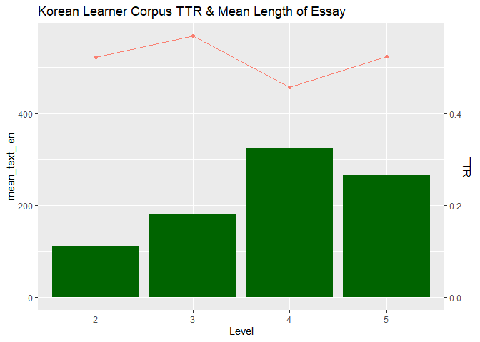
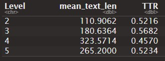
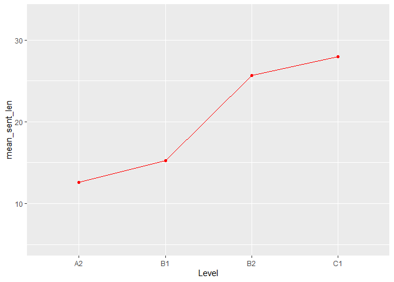
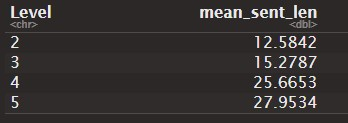
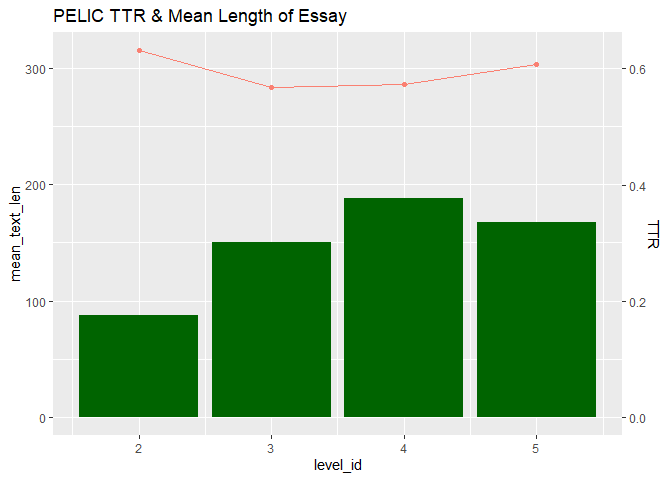
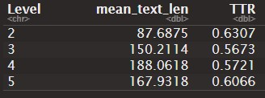
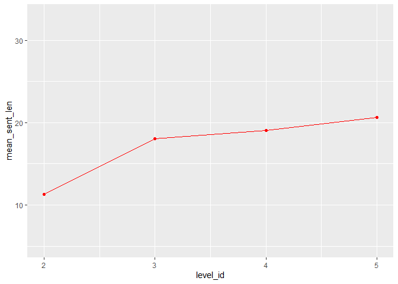
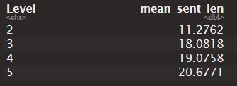

final_report.md
================
Soobin Choi
2022-12-12

- <a href="#introduction" id="toc-introduction">Introduction</a>
- <a href="#methodology-and-data"
  id="toc-methodology-and-data">Methodology and Data</a>
- <a href="#analysis" id="toc-analysis">Analysis</a>
  - <a href="#intragroup-analysis" id="toc-intragroup-analysis">Intragroup
    analysis</a>
    - <a href="#korean-learner-corpus" id="toc-korean-learner-corpus">Korean
      Learner Corpus</a>
    - <a href="#pelic" id="toc-pelic">PELIC</a>
  - <a href="#intergroup-analysis" id="toc-intergroup-analysis">Intergroup
    analysis</a>
- <a href="#conclusion" id="toc-conclusion">Conclusion</a>
  - <a href="#overall-history-and-process-of-the-project"
    id="toc-overall-history-and-process-of-the-project">Overall history and
    process of the project</a>

# Introduction

The Foreign Service Institute (FSI) reports that Korean is one of the
most difficult languages to learn for English-speaking students. In
order to obtain a certain degree of proficiency in the Korean language,
FSI claims that it takes 88 weeks for those whose first language is
English. This can be interpreted the other way around: English is one of
the most difficult languages to learn for those whose first language is
Korean. Based on this fact, this project seeks to determine if there is
any difference in language learning development between each group of L2
learners due to the typological difference between English and Korean.

# Methodology and Data

To evaluate the level of language proficiency and provide a comparison
within each group of L2 learners, two indicators are used: syntactic
complexity and lexical diversity. Syntax complexity refers to the length
of sentences. It is used to measure the ability to construct complex and
long sentences in a target language. The concept of lexical diversity
relates to words. It provides information regarding the vocabulary range
of learners. For the purpose of the project, two corpora are selected:
Korean Learner Corpus (Park 2016), and the University of Pittsburgh
English Language Institute Corpus (PELIC) (Juffs, Han and Naismith
2020). Both corpora fit into this project in that they contain the
information of the level of proficiency of each speaker with the same
criteria (Common European Framework of Reference for Languages (CEFR)),
and the raw data (essays of each speaker). Due to the differences in
language typology, different tokenization methodologies are deployed for
each language. English language, as an analytic language, can be
tokenized by white space because it is generally the case that each unit
divided by white space is a word. Korean language, however, as a
synthetic language, cannot be tokenized in the same way as English
because one word segment often contains more than one word. Therefore,
in Korean NLP, words are tokenized by morpheme boundaries.

# Analysis

## Intragroup analysis

### Korean Learner Corpus

1.  Lexical Diversity

<figure>

<figcaption aria-hidden="true"><em>Korean Learners Lexical Diversity by
Level</em></figcaption>
</figure>

<figure>

<figcaption aria-hidden="true"><em>Numeric Values of Korean Learners
Lexical Diversity by Level</em></figcaption>
</figure>

For the visualization of lexical diversity of each corpus, a mixed plot
of bar graph and line graph is used to investigate two factors at the
same time: type-token ratio (TTR), and the mean length of individual
essay. The green bar graph represents the mean length of individual
essay in each level group, and the endpoints of pink line graph
indicates the mean TTR of each level. The y-axis for TTR is on the right
side, and that of mean length of individual essay is on the right side.
The reason we should look at both TTR and mean essay length is that TTR
is text-length sensitive; it does not proportionally increase along with
the length of the text.

As can be seen from the plot, TTR at level 3 peaks sharply, followed by
an even sharper decline at level 4. Based on the fact that the mean
essay length also increased between levels 3 and 4, the peak of TTR at
level 3 has significance in terms of proficiency improvement. The
substantial decrease at level 4 is somewhat expected since the average
essay length has increased substantially at the same level. Upon
comparison of the lowest and highest level, the plot reveals almost the
same TTR value, which may be considered disappointing. There is,
however, a striking difference in the average length of essays. Compared
to level 2, the average essay length at level 5 is more than twice as
long. Due to the fact that the TTR does not increase proportionally as
the mean text length increases, it is inferred that there is a large
difference in language proficiency between the groups. Across the stages
of language development, it is confirmed that the proficiency of Korean
language improves the most between level 2 and 3 since the level 3
learners show the greatest advance with regards to both TTR and mean
text length compared to that of level 2.

2.  Syntactic complexity

<figure>

<figcaption aria-hidden="true"><em>Korean Learners Syntactic Complexity
by Level</em></figcaption>
</figure>

<figure>

<figcaption aria-hidden="true"><em>Numeric Values of Korean Learners
Syntactic Complexity by Level</em></figcaption>
</figure>

In respect of syntactic complexity, the graph manifests a steady growth
across all levels. There was no unexpected change contrary to the result
of lexical diversity, and the biggest leap in improvement occurred
between level 3 and 4.

### PELIC

<figure>

<figcaption aria-hidden="true"><em>PELIC Lexical Diversity by
Level</em></figcaption>
</figure>

<figure>

<figcaption aria-hidden="true"><em>Numeric Values of PELIC Lexical
Diversity by Level</em></figcaption>
</figure>

In contrast with the TTR value of KLC, the TTR value of PELIC corpus
does not exhibit lots of fluctuations between the levels. The TTR value
for level 3 speakers of English is the lowest while the TTR value of
level 2 speakers is the highest. Comparing the results between the
lowest level and the highest level, the graph indicates that while the
TTR values of level 5 decreased by .03, the mean length of essay
increases by 1.9 times at level 5. In light of the fact that the
decreased amount of TTR is negligible but the increase in mean text
length is considerable, we can conclude that there is also a stark
difference in language proficiency between level 2 and level 5 in
English learner groups. On the graph, it appears that the greatest
improvement occurs between levels 3 and 4, considering that the TTR
value nearly remains the same during when the mean essay length
increases by 20%.

<figure>

<figcaption aria-hidden="true"><em>PELIC Syntactic Complexity by
Level</em></figcaption>
</figure>

<figure>

<figcaption aria-hidden="true"><em>Numeric Values of PELIC Syntactic
Complexity by Level</em></figcaption>
</figure>

In terms on syntactic complexity, the tendency observed in the graph
above does not differ from that of Korean learners. A stable improvement
across the levels is shown, with the biggest leap occurring between
level 2 and 3. Interesting point in this data is that there seems to be
no meaningful improvement in the mean length of essay between level 3 to
5.

## Intergroup analysis

Comparing the levels that display comparable sizes of mean essay length
is also a meaningful approach since the length of an essay is an
important factor to determine if the TTR value is significant. Level 3
of KLC and level 4 of PELIC contain almost identical value of TTR and
mean text length, which denotes that they own a similar degree of L2
proficiency. This means that English learners obtain the comparable
competence of language at level 4 whereas Korean learners obtain an
equivalent degree of L2 proficiency at level 3. Hence, we can conclude
that Korean learners attain the higher level of proficiency of L2 at an
earlier stage than English learners in terms of lexical diversity.

On the other hand, the graph shows the opposite result regarding
syntactic complexity. The mean length of sentences at level 1 in both
datasets is comparable. However, as the mean essay length of Korean
learners increases faster than that of English learners, Korean learners
overtake English learners at level 4. Furthermore, it is English
learners who exhibit greater improvements at the early stages, in
contrast to lexical diversity. However, the mean length of sentences of
an advanced learner of Korean is longer than that of an advanced learner
of English. Therefore, we can conclude that Korean learners acquire a
higher level of syntactic complexity when they reach the most advanced
level of L2 compared to English learners. This can be emanated from the
typological feature of English as an analytic language. Since Korean is
a synthetic language and it possesses an abundant number of morphemes
whose function is to connect sentences, it is relatively easier to
elongate sentences in Korean, although elongating sentences excessively
carries the risk of ruining legibility.

# Conclusion

This project investigates the difference of lexical diversity and
syntactic complexity among two learners’ group. One group comprises
Korean learners whose first language is English, and the other group
consists of English learners whose mother tongue is Korean. Regarding
lexical diversity, Korean learners show the biggest improvement in L2 at
an earlier stage than English learners. However, with regards to
syntactic complexity, English learners demonstrates the biggest leap at
an earlier stage than Korean learners. Considering that Korean is a
synthetic language and has a rich pool of morphemes that connects
sentences, it is inferable that this feature can be the result of the
different typological feature of Korean and English.

### Overall history and process of the project

Luckily, I was able to find corpus that fit into the purpose of my
research. Moreover, they were well-organized, so there was no need to
wrestle with the data. The problems and issues that I encountered during
my journey was mostly related to the data tokenization. Sometimes I was
not sure what code I should use, sometimes I know what code should be
used in a case but not sure *how* to use it, and many many times R
crashed because of the huge amount of tokenized data. But, with the help
of the classmates and Dan, the project is successfully done.
