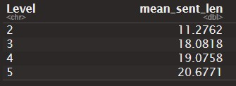

```{r setup, message=FALSE}
knitr::opts_chunk$set(echo=TRUE, include=TRUE, comment="")
library(tidyverse)
library(tidytext)
library(repurrrsive)
library(quanteda)
library(magrittr)
library(ggplot2)
```


# Introduction


The Foreign Service Institute (FSI) reports that Korean is one of the most difficult languages to learn for English-speaking students. In order to obtain a certain degree of proficiency in the Korean language, FSI claims that it takes 88 weeks for those whose first language is English. This can be interpreted the other way around: English is one of the most difficult languages to learn for those whose first language is Korean. Based on this fact, this project seeks to determine if there is any difference in language learning development between each group of L2 learners due to the typological difference between English and Korean.


# Methodology and Data


To evaluate the level of language proficiency and provide a comparison within each group of L2 learners, two indicators are used: syntactic complexity and lexical diversity. Syntax complexity refers to the length of sentences. It is used to measure the ability to construct complex and long sentences in a target language. The concept of lexical diversity relates to words. It provides information regarding the vocabulary range of learners. For the purpose of the project, two corpora are selected: Korean Learner Corpus (Park 2016), and the University of Pittsburgh English Language Institute Corpus (PELIC) (Juffs, Han and Naismith 2020). Both corpora fit into this project in that they contain the information of the level of proficiency of each speaker with the same criteria (Common European Framework of Reference for Languages (CEFR)), and the raw data (essays of each speaker). Due to the differences in language typology, different tokenization methodologies are deployed for each language. English language, as an analytic language, can be tokenized by white space because it is generally the case that each unit divided by white space is a word. Korean language, however, as a synthetic language, cannot be tokenized in the same way as English because one word segment often contains more than one word. Therefore, in Korean NLP, words are tokenized by morpheme boundaries.

# Analysis

## Intragroup analysis

### Korean Learner Corpus 

1. Lexical Diversity


For the visualization of lexical diversity of each corpus, a mixed plot of bar graph and line graph is used to investigate two factors at the same time: type-token ratio (TTR), and the mean length of individual essay. The y-axis for TTR is on the right side, and that of mean length of individual essay is on the right side. The reason we should look at both TTR and mean essay length is that TTR is text-length sensitive; it does not proportionally increase along with the length of the text. 
In the plot, a sharp peak of TTR at level 3 is observed, and it is followed by even sharper plunge at level 4.
1. A sharp peak at level 3 followed by a sharper plunge at 4
  
   Considering the mean text length, it is expected because TTR is text-length sensitive. they do not have linear relationship.
   
2. 2 vs. 5 - *more than double* the size in mean text length, but same TTR, _or a very little higher!_.

3. Expected that mean text length also increase by the level; not true.

4. Between level 2 and 3, TTR increased by .04.
    
  And the mean text length also *increased by almost 40%.*


2. Syntactic complexity


1. Increased steadily across all level 

2. Biggest improvement: from B1 to B2

3. There was no unexpected change - A2 the lowest, C1, the highest.


### PELIC

 

 


1. Quite steady value of TTR compared to that of KLC.

   Between level 3 and 4, the text length increased 20%; and TTR also increase.
   
2. A2 vs. C1 - almost double the size, but TTR decreased only by .03.

  _compare this to KLC corpus, we 
 
3. Between level 4 and 5, TTR increased. But the mean text length decreased.





1. Steady increase, just like KLC

2. Biggest improvement: from level 2 to level 3. 

3. From level 3 to 5, no big difference, which is a surprise.


## Intergroup analysis

### Lexical diversity


1. Level B2 and level 4 - longest mean text length across all levels, not level C1 and level 5.

2. Both the highest level ranked 2nd in terms of TTR.

3. Answering to my research question..

     **Between which levels does the language proficiency increase the most?**

-> KLC: Between level A2 and B1  _이유설명_       //      PELIC: Between level 3 and 4. _이유설명_

    **Is there any difference in terms of *lexical diversity* in the same level of different L2 speakers?**

 * Level B1, Level 3
 
  - In KLC, mean text length increased, and TTR as well. But in PELIC, 
  mean text length increased, but TTR ***decreased**
  
 * Level B1, Level 4
 
  - almost the same size of mean text length, almost the same value of TTR
  
    BUT! KLC level B1 is equivalent of Level 3 in PELIC.
    
  _which means that English learners attained the higher level of proficiency earlier than Korean learners in terms of lexical diversity._
 

 * What about Level B2 and Level 4?
 
 - Can also find difference; in KLC TTR substantially decreased whereas it increased slightly in PELIC. With regards to the length of the mean text length, KLC has a lot larger MTL.
  _However_, the sample size! 


### Syntactic complexity


1. Level B1 vs. Level 3: PELIC has higher mean sentence length.
   But, Level B2 vs. Level 4: KLC is A LOT higher.


1. Answering to my research question..

     **Between which levels does the language proficiency increase the most?**

-> KLC: Between level B1 and B2       //      PELIC: Between level 2 and 3.

  **PELIC** shows greater improvement in earlier stage of learning.

    **Is there any difference in terms of *syntactic complexity* in the same level of different L2 speakers?**

  In Level B1 and Level 3, PELIC has higher mean sentence length, 
  but in Level B2 and Level 4, KLC outdistance PELIC!
  And this aspect persists in Level C1 and Level 5, too.
  
  
# Conclusion
